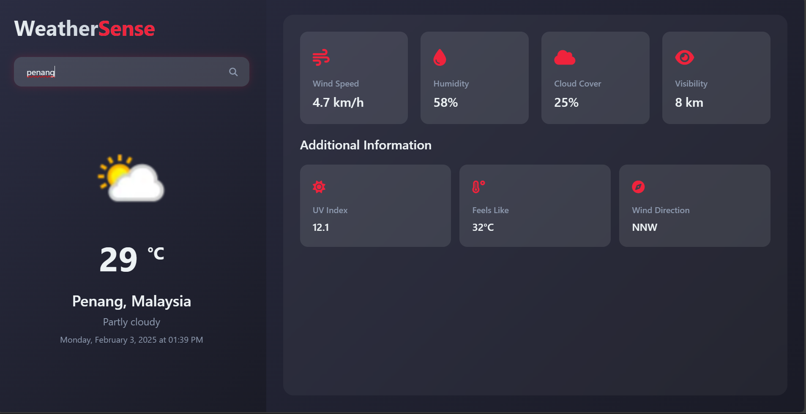

# Weather App

A modern and responsive weather application that provides real-time weather information using weather API integration.

## Features

- Real-time weather data display
- Search functionality for different locations
- Responsive design for all devices
- Beautiful UI with modern aesthetics
- Dynamic weather icons and backgrounds

## Screenshot


Features shown in the interface:
- Current temperature display (29°C)
- Location information (Penang, Malaysia)
- Weather conditions (Partly cloudy)
- Wind Speed (4.7 km/h)
- Humidity (58%)
- Cloud Cover (25%)
- Visibility (8 km)
- Additional information including:
  - UV Index (12.1)
  - Feels Like Temperature (32°C)
  - Wind Direction (NNW)

## Technologies Used

- HTML5
- CSS3
- JavaScript
- Weather API Integration

## Setup

1. Clone the repository
```bash
git clone https://github.com/chengwei121/Weather_Api.git
```

2. Open `index.html` in your web browser

## Usage

1. Enter a city name in the search box
2. Press enter or click the search button
3. View detailed weather information for the selected location

## Contributing

Pull requests are welcome. For major changes, please open an issue first to discuss what you would like to change.

## License

[MIT](https://choosealicense.com/licenses/mit/) 